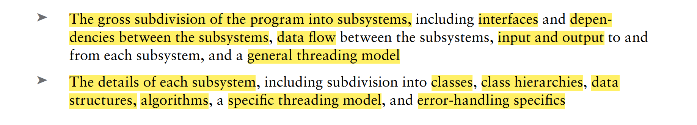

##  Chapter 1:

- *import* and *modules*
- namespace alias :
- nested namespace :
- std::bytes
- std::numeric_limits
- std::isinf, std::isnan
- using enum *enum type*
- .cppm && *export*

- [[ nodiscard()]]
- [[ fallthrough ]]
- [[ maybe_unused ]]
- [[ noreturn ]]
- [[ deprecated("say something") ]]
- [[ (un)likely ]]

- std::size(), std::ssize()

- initialization for array with automatically deduction the sepcified type
                
             std::array arr {1, 2, 3, 4} // equal to std::array<int, 4> arr {...};
             std::vector varr {1, 2, 3, 4, 5} // equal to std::vector<int> varr {...}
             //...

- std::optional<>

    + *nullopt*
    + std::optional<T>::has_value()
    + std::optional<T>::operator bool ()
    + std::optional<T>::value_or(T otherwise)
    + std::optional<T>::value() // throw std::bad_optional_access if failed
    + cannot use reference type to specify the template class

- structure binding
- initializeation in range-based for loops 
- designated initialize
- consteval

## Chapter 2

- std::literal::string_literal  : operator ""s (const char *, std::size_t);
- std::sto*();
- <charconv>

    * to realize the so-called perfect round-tripping
    
    * to_chars :
            
                std::to_chars(char * F, char * L, [IntegerType][floatType] i);
                std::to_chars(char * F, char * L, FLOAT_TYPE f, 
                    std::char_format fmt, int precision);
    * to convert from strings

                std::from_chars(char * F, char * L, FLOAT_TYPE f, 
                    std::char_format fmt);

- std::string_view 
    
    - string_view_literal

- std::format 

     - all the signature :

            for all : {index  :  [fill character] [<^> align type]width},
            for numbers  : [ : [align type][+/-][ space][width]]  
            for integers : [# add prefix for a integer type][width][d / o / x]
            for float-point-type : [width][e/g/f/a], [width.precision][f/e/g/a]
            others : [s/c/p]
- speicfy std::formatter<> 

    - reload typename decltype(context.begin())(__constexpr auto formatter::parse(auto& context)__
    - reload typename decltype(context.begin())(__constexpr auto formatter::format(T& type, auto& context)__
    - while in parse, iter range in the specified manipulator, context.begin() would pointer to '}' if there is no manipulators. 
    - while in format, use *format_to(auto contextDotOut, const char * formate, Args&&...args)* to replace {...} with the resulting string

## Chapter 3

- comment 
    * function for example :
            
            /**                 or 
             * @parameters :            // Parameters :
             * @returns:                // Return :
             * @throws:                 // Throw :      
             * 
             */

    * explain complicated code
    * add meta-information
- code style

## Chapter 4 

- progrmming design && software design
 
    * 
    

## Chapter 5
## Chapter 6
## chapter 7

- memory leaks 
- unique_ptr

     * *make_unique* && *make_unique_for_overrite()*
     * unique_ptr with C-Style array

            auto arr { std::make_unique<int[]>(10) }; // since c++17
- shared_ptr

         shared_ptr< T >(T * ptr, void(*ptr_free_handler)(T *) ); 
         // It indicates that shared_ptr<> isn't only for 
         // dynamtically allocated object
    +  casting tool for shared_ptr<>    
           * static_pointer_cast<>
           * const_pointer_cast<>
           * reinterpret_pointer_cast<>
    + alias 

            shared_ptr< MT >(shared_ptr<T> obj, MT * mem_of_obj);
            // point to member of the stored object
- weak_ptr
- class enable_shared_ptr_from_this
### Chapter 8
    
- explicit(/*conditional value*/) mem_func();

- std::exchange();  
- std::as_const();

## Chapter 11

- *C++20 Module*
    
    - Merits && Advantage 
      - Time safer ：
             
    >> 模块文件可以更好地弥补头文件的缺点。首先，与头文件不同, 模块被导入的顺序不会给编译带来任何问题, 且模块文件只需被编译一次,但头
    >> 文件的编译次数却是其被包含次数。其次， 对于一些在模块文件中定义的接口方法，改变其实现并不会导致整个模块被重新编译。同时模块中
    >> 不会出现宏定义污染的情况，任何在模块中定义的宏对外都是不可见的。
    - 
         
- *Module Interface Files*  
  + cppm
    *  Declare module entity by using keyword module (usually *export module* for main module)
    *  Declare interface by using keyword *export*  
    *  *global module fragment*
       + Can only conatin preprocessing directives(#include) which is the scope where we can put C Head File including command  
    * Suppose those identifiers like class, namespace etc. containing independent scope declared as *export*, definitions
        can be implicitly *export*.
    * Block export declareation  
        ```
            export
            {
                //...other difinations
            }
    * implementation file of the moudle 
        + Still to introduce the module file by *module* keyword which implicitly import the module file 
            and other import files required as well. 
    * visibility versus Reachablility
        + we can simply use *export import <>* or *import <>* to decide if some module shouble be part of 
            the module that together becomes a visible or but reachable interface.  
    * Simple Support for Submodule
        + we can simple use *dot* to entitle a module to indicate that its's a submodule of a module 
        ```
            // For instance:
            export module data.person   // person shouble be a submodule of the module data   
    * Module Partition
        ```
            // Form
            export module data : person // person is a partition of the data 
        ```
            // in primitive module file
            export module data;
            export import : person      // so import data can use class person 
        +  demerits : 
           - unable to be visible for users, which means any declaration like *import data : person* is illegal
           - Can not have it's own implementation file, for declaration of *import* is not allowed, yet can be put
                into the implementation file of the original module 
    * Head Units
-  __has_inclue("fileanme") to check if the head file exists
-  __cpp_* to check the cpp if standard features supported
-  Static Functionalities
   - declare a funtion to be internal (or by using anonymous namespace )
   - *extern* note : the initialization order of the non-local variable remains unknown 
## Chapter 12
- variable template;
  - 
- concept
  - concept name = {expression(false/true)}
- requires 
  - requires(parameter) {expression} 
  - To check if the expression is vaild     

            // Example
            template<T>
            concept x = require(T X, T y) {
                {X.swap(Y)} noexcept ->std::converible_to(size_t) ;    
                // if T has method swap() marked noexcept and the return value can convert to a size_t
                ++X, --X ;                       // if T can apply increment or decrement
            }
    - Things with which you can combine requires can result in a boolean
      - concepts

                // Example : 
                    // std::convertible_to<T1, T2>
                 typename<std::convertible_to<bool> T>
                //or
                typename<class T> requires std::convertible_to<T, bool>
      - rquires 

                template<typename T> requires requires(T X) {++X;}
      - type_traits 

                template<typename T> requires std::is_arithmetic_v<T>
      -  or
        
                template<typename T> requires (sizeof(T) == 4)
    - Also can be function template, class template
        - class 

                template<std::Derived_from<GamePiece> Pieces>
                class Grid {}    
        - function 

                template<typename T>
                void foo() requires std::floating_point<T> 